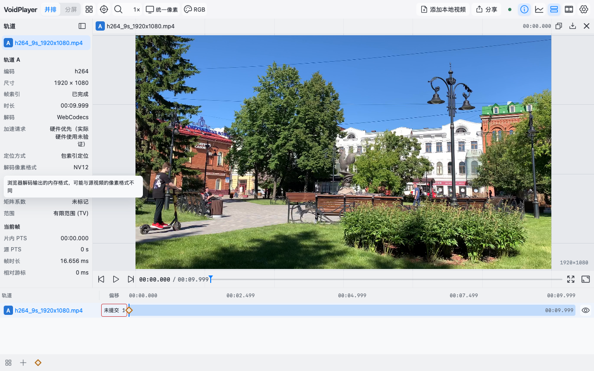

# Issue #38: Mac validation

Baseline is untouched main `83de4b039a2c13fdea44ce4ad35abcd282264589`. The isolated baseline and feature checkouts use the same Mac (Apple M5, arm64), Node 24.15.0, Vite 8.2.2, TypeScript 7.0.2, Playwright/browser binaries and identical core/media files. Original checkouts and running services were not changed. Both distributions are production builds. No original assertions, case coverage or playback thresholds were weakened.

The implementation covers 669 extracted messages, all UI modules, complete settings, shell and track controls, plus sources/workspaces/annotations/analysis. Explicit exclusions are in [localization](localization.md) and `locales/scope.json`: connection guide/admin and raw diagnostic reasons remain Chinese; user data/log JSON and stable machine values are preserved deliberately.

## Verified behavior

- `fast`: 30/30 registered cases; `contract`: 10/10. Nine new Node assertions cover normalization, stale requests, failure/retry, compiled fallback/cache, ICU parameters, typed descriptors, escaped user values, stable diagnostic stages, deterministic generation, Windows separators/CRLF checkout validation, stale/missing catalog rejection, scope completeness and translation-free media/progress dependency graphs.
- `ci-i18n`: Chromium and WebKit state-preservation and long-text cases, 4/4. Live switching preserves canvas, worker count, media/source generation, selected track, inspector/dock/mark nodes, playing position, open settings/menu, input values, focus and selection. It issues no seek/pause/reload. Tests cover unsaved offsets, workspace name and feedback text, raw user marks, real tooltip relabeling, onboarding filter/active option and file-relink dialog preservation, folder metadata and stalled-load cancel controls, rapid choices, delayed cold responses, blocked English chunk and same-page retry, refresh persistence and browser/stored locale precedence.
- Expanded pseudo text: every settings pane at 1280/600/390/320px in both engines. Strict bounds and text-clipping assertions found and drove fixes for language/workspace/log/identity controls. CJK and English screenshots were visually inspected. Long edge labels use vertical color-flow steps while preserving nodes.
- Existing player/analysis/identity/saved-workspace/sharing/theme/menu/metadata/settings/feedback/annotation/recovery and logging regressions passed across their applicable Chromium/WebKit cells. The final Mac `uncovered` batch passed 20/20. An earlier Chromium library-pagination timeout also reproduced on untouched baseline; it was retained during diagnosis and did not recur in the final full batch. Its assertion was not removed or relaxed. The focused-tooltip fix additionally passes all six original feedback/menu/shortcut cells and both complete player cells.

## Paired performance evidence

Three cold contexts and three same-context warm reloads per browser locale and distribution. Startup ends at `window.voidPlayer.tools`; resource accounting includes emitted assets, theme CSS and theme-init. gzip is an offline estimate: the isolated local static server serves uncompressed bytes. Language timing records click handler to lang-mutation delivery after synchronous UI updates; click-to-ready is reported separately because it includes Playwright scheduling. Playback uses the application’s unchanged `benchmark_review`, three 4-second repetitions per distribution, H.264 `h264_9s_1920x1080.mp4` + HEVC `h265_10s_1920x1080.mp4`, visible page at 1280×800. Both distributions now open and close the appearance settings pane and settle two animation frames before playback; recorded focus, popup, locale and canvas geometry match. Visible Chromium is measured baseline→feature and then feature→baseline. Physical screen scanout and hardware-decoder use are not inferred.

| Initial locale | Baseline raw / gzip | Feature raw / gzip | Asset requests |
| --- | ---: | ---: | ---: |
| Chinese | 1,005,275 / 299,469 B | 1,072,676 / 315,653 B | 28 → 30 |
| English browser | 1,005,275 / 299,469 B | 1,111,340 / 327,304 B | 28 → 31 |

The Chinese gzip increase is about 15.8 KiB; English adds about 11.4 KiB beyond Chinese. Predeclared budgets are +32 KiB/+3 requests for Chinese, +48 KiB/+4 requests for English, median startup ≤ baseline×1.3+100ms, cold locale commit ≤250ms and cached commit ≤100ms. Existing playback limits remain speed≥0.9, frame lag/skew≤100ms, p95 draw gap≤75ms, maximum gap≤250ms and pause≤100ms.

The final candidate runtime source digest is `a64d2afdb99607f5ac437b0b5d32bd77e519d4bff9f3877cb2b4847169bb48e5`. Per-run metadata records `d1783a9-dirty` because measurements preceded committing this tooltip fix; the source and decoder digests identify the exact runtime. [Performance evidence](evidence/i18n/performance.json) preserves every primary repeat, original limit, matched preparation and historical results. gzip estimates vary by one or two bytes with build metadata.

| Browser/configuration | Chinese cold / warm median, baseline → feature | English cold / warm median, baseline → feature | Playback (baseline + feature) |
| --- | --- | --- | --- |
| Chromium 153, WindowServer, H.264 + HEVC, AB | 105.1→103.8 / 55.3→53.4 ms | 95.7→99.0 / 55.4→61.3 ms | 6/6 pass |
| Chromium 153, WindowServer, H.264 + HEVC, BA | 100.3→108.8 / 56.7→61.3 ms | 101.5→99.1 / 50.5→60.4 ms | 6/6 pass |
| WebKit 26.6, H.264 + HEVC | 223.6→227.9 / 77.0→71.6 ms | 218.5→212.0 / 75.4→75.6 ms | 6/6 pass |
| Chromium 153, headless, H.264 + H.264 | 100.2→97.0 / 50.3→47.2 ms | 98.4→93.8 / 50.5→49.7 ms | 6/6 pass |

All startup/request/gzip and locale-commit budgets pass in these configurations. Cold English commit is 11.2–11.8ms (visible Chromium), 24.2ms (WebKit), 25.8ms (headless H.264); cached commits are 6.0–14.4ms. The 24 primary playback repeats run at 0.9986–1.0000× and pass unchanged gap/lag/skew/pause limits. Chromium observed no long tasks in those runs; WebKit does not expose that API.

The two initial focused-tooltip candidate measurements showed visible Chromium TaskDuration +52–57% (669→1019ms and 675→1061ms). Inspection found asymmetric preparation: only the feature had entered settings before playback. After identical settings preparation, the alternating AB and BA comparisons are 956→1013ms (+5.9%) and 846→853ms (+0.8%). ScriptDuration medians are 47.2→51.6ms and 45.1→44.3ms; style recalculation and layout counts remain comparable (about 853–856 style and 560–563 layout operations per repeat). Headless H.264 TaskDuration is 2347→2351ms (+0.2%). The original large delta is not reproduced with matched preparation. All old measurements remain visible as confounded historical observations; none was deleted to obtain a pass. These small remaining differences and run variation are not a zero-cost or optimization claim.

A separate diagnostic CDP CPU profile covers three full playback repetitions and their setup intervals, approximately 13.4 seconds per distribution. The feature's sampled translation self time is 6.034ms, in dynamic frame/analysis UI labels; its major application stacks remain playback/state/presentation functions. Profiled TaskDuration is 920→868ms, with all six original playback limits passing; profiled timings are not used as the primary unprofiled comparison. [CPU summary](evidence/i18n/cpu-profile-summary.json) includes exact sampled frames, columns, SHA-256 and limitations; [baseline](evidence/i18n/baseline-cpu.json.gz) and [feature](evidence/i18n/feature-cpu.json.gz) compressed raw profiles are retained. Sampling misses short calls and cannot prove zero overhead or exactly partition CDP TaskDuration.

Headless Chromium chooses FFmpeg WASM for HEVC and fails the unchanged real-time floor in both baseline and feature. The final matched negative comparison runs at baseline 0.575–0.594× and feature 0.568–0.576×; all six failed repeats are retained in the evidence and are **not** counted as passes. The same mixed-media pair passes in visible Chromium and WebKit. A concurrent-build ENOENT run and a rejected stale-build-preparation run are excluded from quantitative conclusions; final measurements use owned distribution snapshots and sequential browser workloads.

## CI repairs

The first draft surfaced four new regressions, all repaired without changing the original assertions: portable scope/inventory paths and Vite IDs on Windows, CRLF checkout artifacts versus generated LF, and source status functions disappearing from JSON fingerprints (preventing the stalled-load cancel button). Narrow Chinese workspace controls also retain their original one-line layout; English and pseudo text wrap as needed. The original Chromium/WebKit complete player regressions and WebKit workspace-list case pass on Mac after these fixes. The Windows catalog build, source archive (including `locales/`) and packaged release checks pass on the repair commit. PR CI remains the source of truth for full Linux/Windows completion.

## Tooltip and HTTPS follow-up

The `70806f6` CI run exposed two test assumptions after localization: the Chromium tooltip read raced the next layout frame, and the legacy trusted-HTTPS functional page used its default English browser locale while locating Chinese buttons. Both are repaired without increasing timeouts or removing visible text assertions.

The tooltip issue was reproduced on this Mac with event and geometry tracing. The English decoded-format value occupied y=331.17–355.97px, with the pointer at y=343.57px. Switching to Chinese moved the same value to y=314.38–339.17px because preceding labels no longer wrapped. The open popup first updated correctly to Chinese; a subsequent pointerover targeted the next value and hid it through the existing tooltip lifecycle. There was no scroll or window-blur cause. [Diagnostic evidence](evidence/i18n/tooltip-diagnostic.json) records this sequence.

The regression now waits for translated layout, hovers the actual value, and verifies real English and Chinese popup text. A separate focused-anchor sequence switches English → Chinese → English without another hover/focus event, waits two animation frames, then checks visible translated text, unchanged anchor/popup nodes, retained focus and `aria-describedby`. [Chromium](evidence/i18n/chromium-tooltip.json) and [WebKit](evidence/i18n/webkit-tooltip.json) record the actual texts and geometry. All four `ci-i18n` cells and all six original feedback/menu/shortcut cells pass on Mac. This repaired the Chromium hover race, but the subsequent `d1783a9` CI still failed the original WebKit focused-anchor visibility assertion. The original focus scenario remains intact.

The focused-tooltip follow-up now fixes the runtime lifecycle. On this Mac, forcing a queued inspector scroll reproduces dismissal while `document.activeElement` and document focus remain on the original value: the scroll event calls `hidePopover` before the locale assertion. [Before-fix event trace](evidence/i18n/focused-tooltip-scroll-before.json) records that sequence. This establishes a reproducible local cause; it does not by itself prove the exact Linux event that caused the old CI failure.

Focused help now survives pointer departure, unrelated/stale focusout and unrelated scroll events. Ancestor scrolling repositions it while the value intersects the scrollport; scrolling the value outside the port still hides it. Genuine window blur, resize, pointer dismissal and keyboard dismissal retain their existing handlers. Translation and per-frame paths are unchanged. Tests retain the original English→Chinese→English focused scenario, then separately exercise queued ancestor scrolling and assert the offscreen geometry before the negative dismissal assertion. Actual [Chromium](evidence/i18n/focused-tooltip-events-chromium.json) and [WebKit](evidence/i18n/focused-tooltip-events-webkit.json) event traces, translated popup texts, node identity, focus and `aria-describedby` are retained. `ci-i18n` passes 4/4 on this Mac after reconnection; the new exact-head Linux CI includes the event instrumentation even if the original focused assertion fails.

The `d1783a9` CI first encountered a saved-workspace request ECONNRESET, then one approved diagnostic retry passed all original 20 uncovered cells and exposed the WebKit focused tooltip failure. That commit is not described as fully green. The new runtime requires a fresh complete CI run; the PR checks remain the source of truth. The prior nonblocking trusted-HTTPS benchmark exceeded an original performance limit; its failed data was not relabeled as a pass.

The HTTPS page now explicitly requests `locale: 'zh-CN'`; its Chinese selectors and original media/decoder assertions are unchanged. Other directly constructed browser contexts with Chinese UI selectors were reviewed and already specify Chinese. The trusted-certificate case is restricted to disposable Linux/Windows CI hosts and was not run against this Mac's trust store. Its exact-head CI result remains the validation source.

## Actual UI captures

Machine-readable UI assertions are in [Chromium](evidence/i18n/chromium-ui.json) and [WebKit](evidence/i18n/webkit-ui.json), plus the [Chromium modal/cache](evidence/i18n/chromium-dialogs.json) and [WebKit modal/cache](evidence/i18n/webkit-dialogs.json) assertions. The working directory retains complete `.run/i18n-*` suite logs/screenshots and `.run/i18n-performance/*.json` paired reports. Linux/Windows behavior remains for CI; this report only claims the actual Mac validation above.
