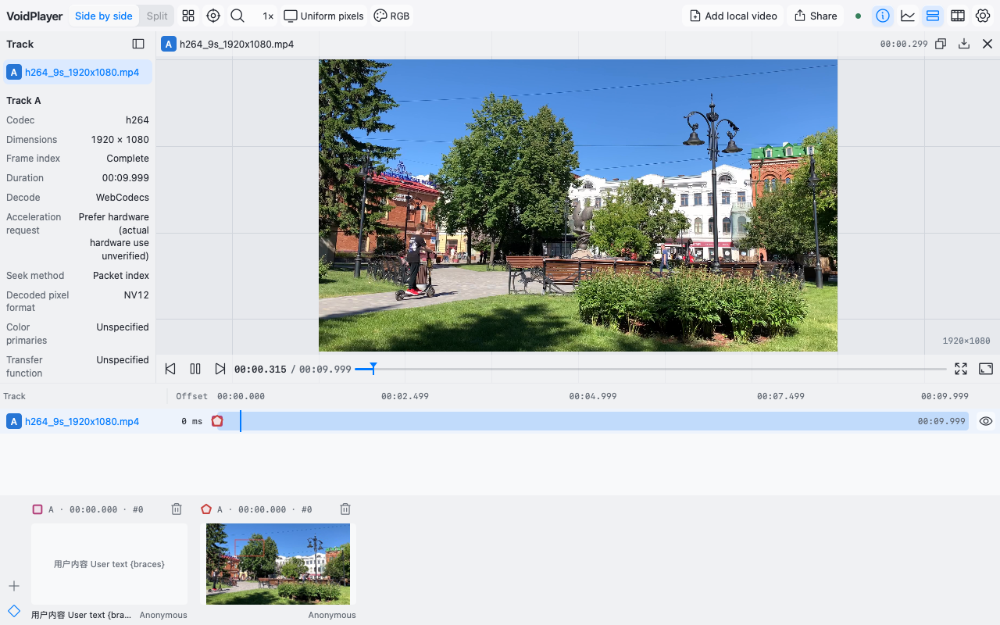
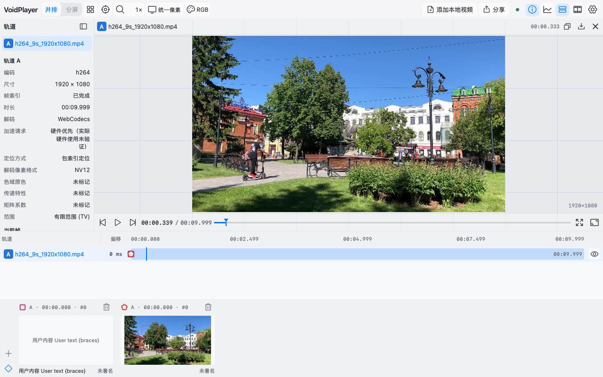
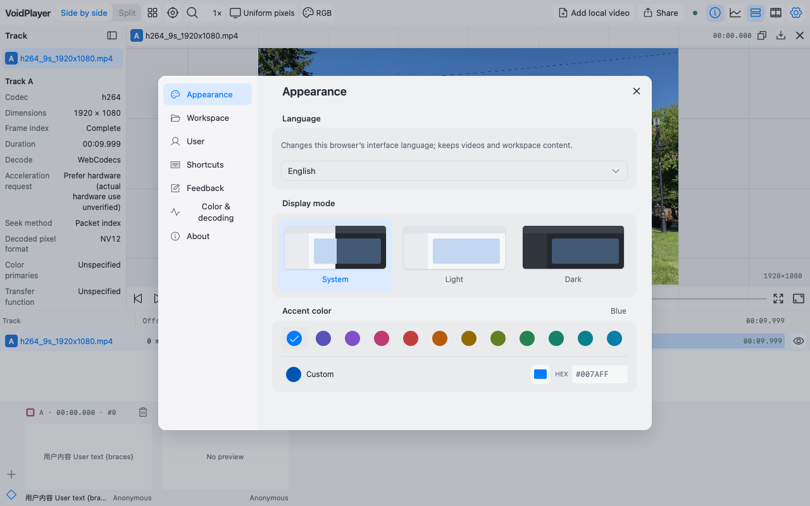
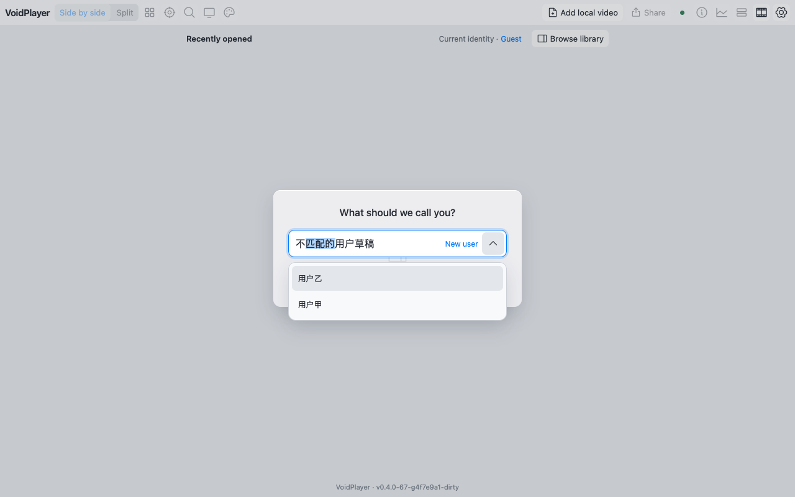
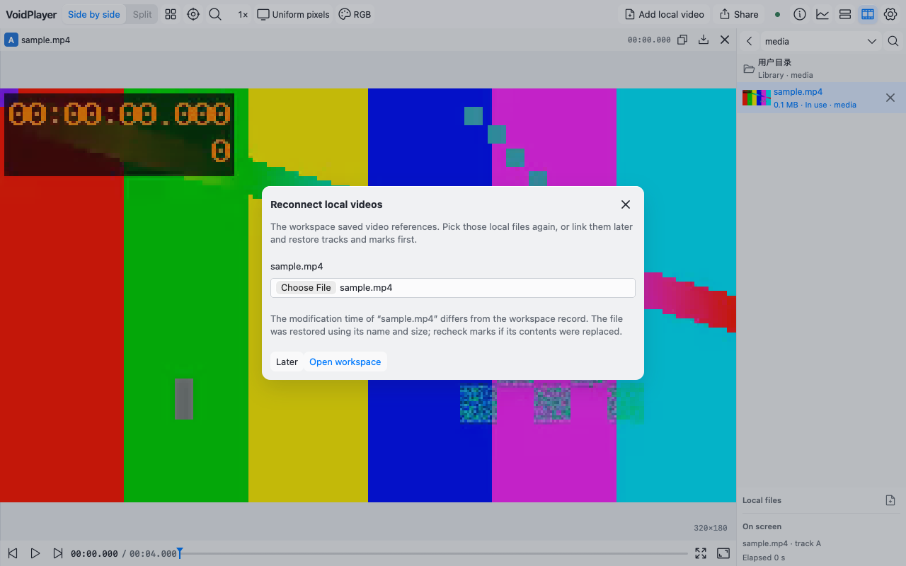
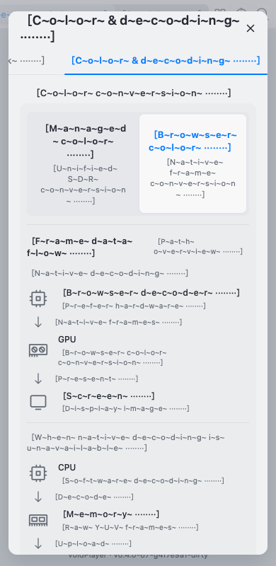

# Issue #38: Mac validation

Baseline is untouched main `83de4b039a2c13fdea44ce4ad35abcd282264589`. The isolated baseline and feature checkouts use the same Mac (Apple M5, arm64), Node 24.15.0, Vite 8.2.2, TypeScript 7.0.2, Playwright/browser binaries and identical core/media files. Original checkouts and running services were not changed. Both distributions are production builds. No original assertions, case coverage or playback thresholds were weakened.

The implementation covers 669 extracted messages, all UI modules, complete settings, shell and track controls, plus sources/workspaces/annotations/analysis. Explicit exclusions are in [localization](localization.md) and `locales/scope.json`: connection guide/admin and raw diagnostic reasons remain Chinese; user data/log JSON and stable machine values are preserved deliberately.

## Verified behavior

- `fast`: 30/30 registered cases; `contract`: 10/10. Nine new Node assertions cover normalization, stale requests, failure/retry, compiled fallback/cache, ICU parameters, typed descriptors, escaped user values, stable diagnostic stages, deterministic generation, Windows separators/CRLF checkout validation, stale/missing catalog rejection, scope completeness and translation-free media/progress dependency graphs.
- `ci-i18n`: Chromium and WebKit state-preservation and long-text cases, 4/4. Live switching preserves canvas, worker count, media/source generation, selected track, inspector/dock/mark nodes, playing position, open settings/menu, input values, focus and selection. It issues no seek/pause/reload. Tests cover unsaved offsets, workspace name and feedback text, raw user marks, real tooltip relabeling, onboarding filter/active option and file-relink dialog preservation, folder metadata and stalled-load cancel controls, rapid choices, delayed cold responses, blocked English chunk and same-page retry, refresh persistence and browser/stored locale precedence.
- Expanded pseudo text: every settings pane at 1280/600/390/320px in both engines. Strict bounds and text-clipping assertions found and drove fixes for language/workspace/log/identity controls. CJK and English screenshots were visually inspected. Long edge labels use vertical color-flow steps while preserving nodes.
- Existing player/analysis/identity/saved-workspace/sharing/theme/menu/metadata/settings/feedback/annotation/recovery and logging regressions passed across their applicable Chromium/WebKit cells. Final broad batch passed 17/18; the remaining Chromium library-pagination cell also fails untouched baseline at `check-library-browser.mjs:69` waiting for 60→70 rows. WebKit’s complete library case passes. This baseline limitation remains explicitly visible; its assertion was not removed or relaxed.

## Paired performance evidence

Three cold contexts and three same-context warm reloads per browser locale and distribution. Startup ends at `window.voidPlayer.tools`; resource accounting includes emitted assets, theme CSS and theme-init. gzip is an offline estimate: the isolated local static server serves uncompressed bytes. Language timing records click handler to lang-mutation delivery after synchronous UI updates; click-to-ready is reported separately because it includes Playwright scheduling. Playback uses the application’s unchanged `benchmark_review`, three 4-second repetitions per distribution, H.264 `h264_9s_1920x1080.mp4` + HEVC `h265_10s_1920x1080.mp4`, visible page at 1280×800. Physical screen scanout and hardware-decoder use are not inferred.

| Initial locale | Baseline raw / gzip | Feature raw / gzip | Asset requests |
| --- | ---: | ---: | ---: |
| Chinese | 1,005,275 / 299,469 B | 1,072,179 / 315,495 B | 28 → 30 |
| English browser | 1,005,275 / 299,469 B | 1,110,843 / 327,146 B | 28 → 31 |

The Chinese gzip increase is about 15.7 KiB; English adds about 11.4 KiB beyond Chinese. Predeclared budgets are +32 KiB/+3 requests for Chinese, +48 KiB/+4 requests for English, median startup ≤ baseline×1.3+100ms, cold locale commit ≤250ms and cached commit ≤100ms. Existing playback limits remain speed≥0.9, frame lag/skew≤100ms, p95 draw gap≤75ms, maximum gap≤250ms and pause≤100ms.

Final runtime source digest is `b9e1a23d30c3e5bc5cd768250d9fe64e38ff116125aa0eea12746fc0a1430eee`. The runtime implementation is commit `3126002`; `46c9ee0` changes only build validation. Their paired runs have identical runtime source and decoder digests; exact per-run build metadata is retained in [performance evidence](evidence/i18n/performance.json). gzip estimates vary by one byte with build metadata.

| Browser/configuration | Chinese cold / warm median, baseline → feature | English cold / warm median, baseline → feature | Playback (baseline + feature) |
| --- | --- | --- | --- |
| Chromium 153, WindowServer, H.264 + HEVC | 80.0→86.2 / 45.9→46.0 ms | 74.8→80.6 / 46.3→49.3 ms | 6/6 pass, 0.9992–1.0000× |
| WebKit 26.6, H.264 + HEVC | 190.9→194.4 / 69.6→72.1 ms | 191.0→182.6 / 71.5→66.6 ms | 6/6 pass, 0.9990–0.9994× |
| Chromium 153, headless, H.264 + H.264 | 78.4→84.8 / 49.6→48.7 ms | 75.8→80.3 / 48.8→49.1 ms | 6/6 pass, 0.9988–0.9991× |

All startup/request/gzip and locale-commit budgets pass in these three configurations. Cold English commit is 16.4ms (visible Chromium), 21.3ms (WebKit), 25.0ms (headless H.264); cached commits are 5.8–14.0ms. Playback gap/lag/skew/pause and the original limits are recorded for each repeat in the evidence JSON. Chromium TaskDuration medians over the benchmark interval are 660→751ms (visible mixed media) and 2027→2076ms (headless H.264). These are overhead observations with run variation, not an optimization or zero-cost claim. In the passing configurations, Chromium observed no long tasks; WebKit does not expose that API.

Headless Chromium chooses FFmpeg WASM for HEVC and fails the unchanged real-time floor in both baseline and feature: baseline 0.669–0.674×, feature 0.658–0.676×. All six failed raw results and their thresholds are retained and are **not** counted as passes. The same mixed-media pair passes in visible Chromium and WebKit. A concurrent-build ENOENT run and a rejected stale-build-preparation run are excluded from quantitative conclusions; final measurements use owned distribution snapshots and sequential browser workloads.

## CI repairs

The first draft surfaced four new regressions, all repaired without changing the original assertions: portable scope/inventory paths and Vite IDs on Windows, CRLF checkout artifacts versus generated LF, and source status functions disappearing from JSON fingerprints (preventing the stalled-load cancel button). Narrow Chinese workspace controls also retain their original one-line layout; English and pseudo text wrap as needed. The original Chromium/WebKit complete player regressions and WebKit workspace-list case pass on Mac after these fixes. The Windows catalog build, source archive (including `locales/`) and packaged release checks pass on the repair commit. PR CI remains the source of truth for full Linux/Windows completion.

## Actual UI captures

Machine-readable UI assertions are in [Chromium](evidence/i18n/chromium-ui.json) and [WebKit](evidence/i18n/webkit-ui.json), plus the [Chromium modal/cache](evidence/i18n/chromium-dialogs.json) and [WebKit modal/cache](evidence/i18n/webkit-dialogs.json) assertions. The working directory retains complete `.run/i18n-*` suite logs/screenshots and `.run/i18n-performance/*.json` paired reports. Linux/Windows behavior remains for CI; this report only claims the actual Mac validation above.
